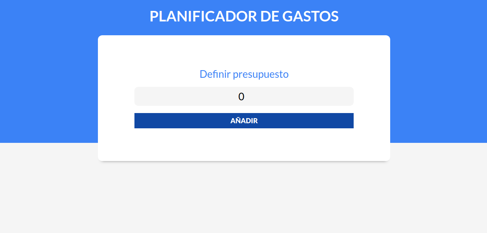
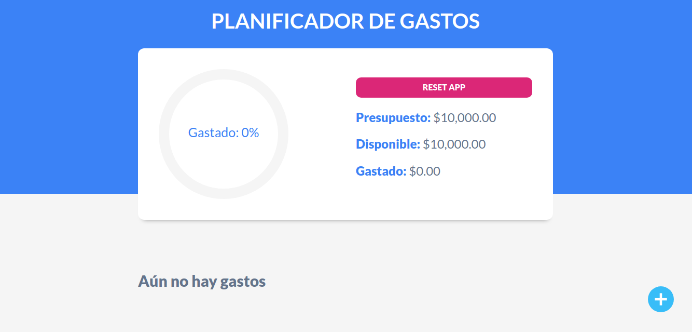
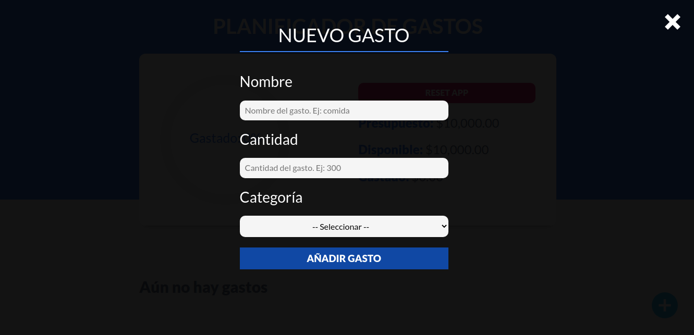
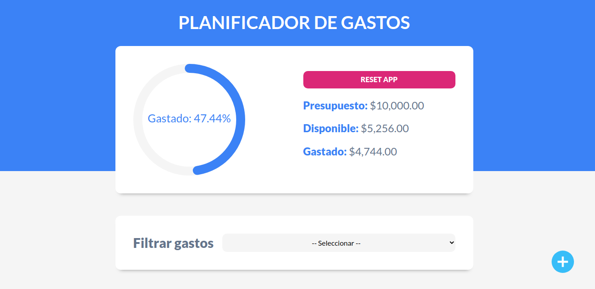
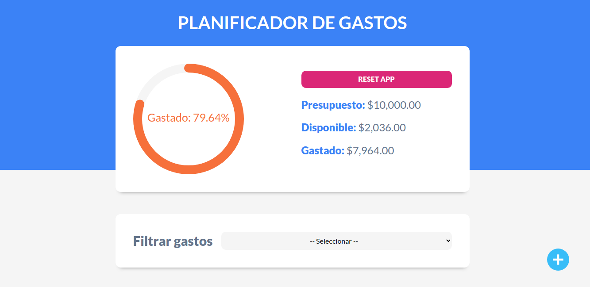
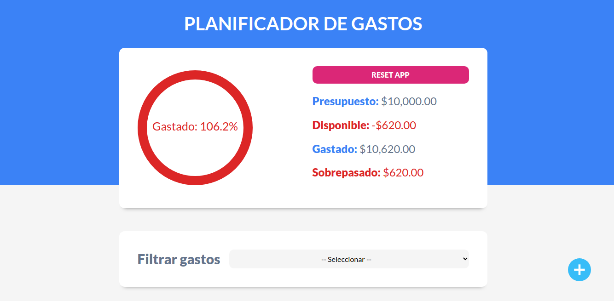
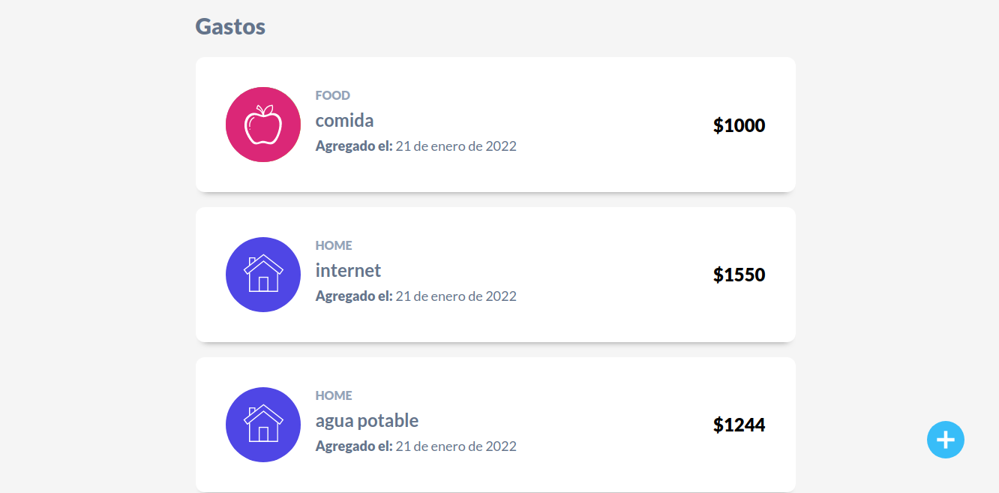
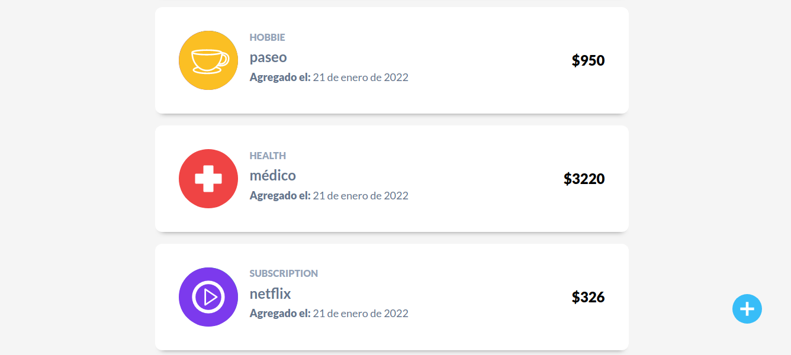

# [Expenses control](https://react-expenses-control.netlify.app "Expenses control")











## Installation

### clone repo **(gh CLI)**
```
gh repo clone norbix14/react-expenses-control expenses
```
### folder
```
cd expenses
```

### install dependencies
```
npm i
```

### run app (vite)
```
npm run dev
```

### build
#### change port (default 3000): **-l** 3000|4000|5000
```
npm run build && serve -s -l 4000 dist/
```
